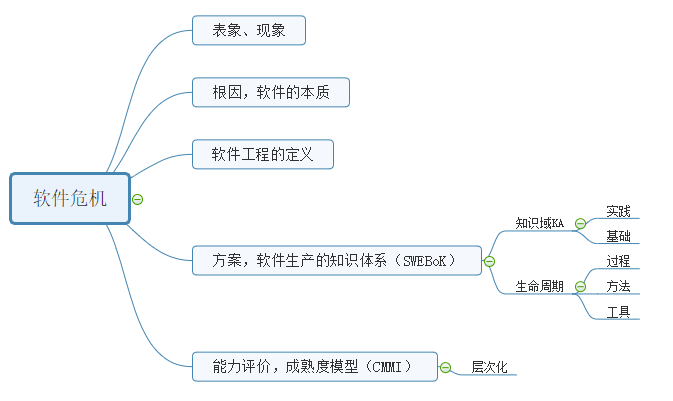

# 软件的本质与软件工程科学
{:.no_toc}

* 目录
{:toc}

## 1、基本概念

### 1.1 软件工程定义

> **Software engineering** is “(1) the application of a _systematic, disciplined, quantifiable_ approach to the _development, operation, and maintenance_ of software, that is, the application of engineering to software,” and “(2) the study of approaches as in (1).” –-- IEEE Standard 610.12

### 1.2 软件危机与软件工程历史

[software crisis](https://en.wikipedia.org/wiki/Software_crisis)/软件危机 术语在 1968 年第一届软件工程大会提出。计算机的发展导致软件危机，软件工程的目标就是克服软件危机，构建生产软件的方法与知识体系。 1972年，Edsger Dijkstra 指出计算能力约强大，编程越是大问题。

“Cost Model” 软件规模（Software Size）估算模型由 Barry W. Boehm 在 1970 年首次提出， [COCOMO](https://en.wikipedia.org/wiki/COCOMO)又称为（Constructive Cost Model）成为估算衡量成本（复杂性）的重要工具。该模型是指数模型，即软件成本与代码行或功能点数量成指数关系。

计算能力按摩尔定律发展，软件处理的问题也越来越广、越来约复杂，因此软件生产不只是编程技术问题，需要有系统化、与时俱进的软件工程方法，才能规避 software crisis ！

### 1.3 软件的本质

 [Fred Brooks](https://en.wikipedia.org/wiki/Fred_Brooks) 是 IBM 360 计算机架构师，负责 360/OS 与工具的开发。它总结了大型软件开发的经验，在 1975 年出版了 ["The Mythical Man-Month"](https://en.wikipedia.org/wiki/The_Mythical_Man-Month) 软件工程的经典著作，中文翻译 [人月神话](https://baike.baidu.com/item/%E4%BA%BA%E6%9C%88%E7%A5%9E%E8%AF%9D/7531243)。首次分析了软件生产的本质以及当时适用解决“大型”软件开发问题的的实践，又称为“ Brooks' law”。

[软件的本质](https://www.sebokwiki.org/wiki/The_Nature_of_Software)决定了软件开发的困难，Brook 总结其本质特性为四个：

1. complexity 复杂性
2. conformity 一致性
3. changeability 可变性
4. invisibility 不可视性

在上述基础上 IEEE 强调了 [软件工程与其他工程相比的特殊性](https://www.sebokwiki.org/wiki/Key_Points_a_Systems_Engineer_Needs_to_Know_about_Software_Engineering)，这里仅给出一些与课程相关的特点

* Software requirements are prone to frequent change
* In many cases, requirements allocated to software must be renegotiated and reprioritized
* Small changes to software can have large negative effects（There are no small software changes）
* The term _prototyping_ has different connotations for systems engineers and software engineers
* Software often provides the interfaces that interconnect other system components
* Cyber security is a present and growing concern for systems that incorporate software
* Several Pareto 80-20 distributions apply to software
    - 20% 功能能满足 80% 人的需要
    - 20% 测试可发现 80% 错误

前3条指出在不一致、不可视、易于变化的环境下定义软件定义（需求）风险。  
接着3条是需要面对的各种设计风险，不仅要能满足软件的变化，而且软件的非功能性需求的实现成本远远高于功能实现成本。  
最后一条是做工程做要理解的之一，软件分析不是发现更多的功能与需求，而是确认有效的功能与需求，去伪存真不断满足客户需要。软件设计也不是追求最先进技术，而是控制变化附加的成本，使得软件生产的预算、时间等能在掌控之中。

### 1.4 软件工程知识体系（SWEBoK）

为了克服软件危机，IEEE Computer Society 构建软件生产的最佳实践与相关知识的框架，称为 [Software Engineering Body of Knowledge](https://www.computer.org/web/swebok/index)。指导软件工程人才的培养与学科建设。 

[2014 V3 版的 SWEBoK](https://www.sebokwiki.org/wiki/An_Overview_of_the_SWEBOK_Guide) 将知识分为软件工程实践和基础教育两个部分，共 15 个知识域（knowledge areas / KAs）。Software Requirements，Software Design 是其中最重要的两个领域。

从实践的角度，Software Engineering Process 从时间维度给出了项目的过程模型（Process Models），其它则从内容角度给出了原则与方法。这样，就得到沿时间轴的二维表，这样软件工程就变成了在什么时刻、工作目标、应该做什么、怎么做的 **最佳实践指南**。

**软件生命周期**（Life Cycle）：在时间维度，对软件项目任务进行划分，又成为[软件开发过程](https://en.wikipedia.org/wiki/Software_development_process)。常见有瀑布模型、螺旋模型、敏捷的模型等。

因此，软件工程实践包含过程、方法、工具三个要素：

* 过程：任务实施的步骤
* 方法：每步工作的内容、标准
* 工具：使得工作半自动化、自动化的工具

### 1.5 能力成熟度模型集成（CMMI）

SWEBoK 不合适度量一个企业的软件工程能力。出于成本的因素，企业在不同阶段难以完全遵循软件工程规范去做事。例如：

* 2-3人的创业团队，需求分析、软件设计、甚至项目管理都是奢侈的活动，因为你仅需要拿出可运行的 demo 获得投资。（创业成功需要英雄）
* 当企业拥有 10-50 人的技术团队，没有配置管理是不可想象的事情，项目管理、分析设计、质量管理更不用说。你需要对你的客户负责。（项目成功需要管理和规范）
* 当企业具有 50-300 人的技术团队，企业管理标准化、人才管理就显得尤其重要了（企业成功需要人才队伍）
* 企业规模再大一些，老板已无法认识每位员工，只能通过数字/报表管理了，基于绩效的管理与优化就重要了（规模企业需要治理）

软件能力成熟度模型（Capability Maturity Model for Software / CMM）或 [CMMI](https://en.wikipedia.org/wiki/Capability_Maturity_Model_Integration)，通过使用知识（能力）的不同，用不同级别表示开发企业的成熟性，不仅给出了企业能力提升的路径，也给出了企业能力评估的事实标准。

### 1.6 软件工程相关标准

[ISO 9000 系列](https://baike.baidu.com/item/ISO9000%E7%B3%BB%E5%88%97%E6%A0%87%E5%87%86) 质量管理体系。基本思想是通过标准化生产行为，保障并提升产品质量。其核心是 [PDCA](https://en.wikipedia.org/wiki/PDCA) 循环模型的建立与实施。

案例研究：假设有企业为学校提供课堂教学设备保障和打扫厕所业务，使用如下方法，可以检查该企业是否达到 ISO 9000 要求：

| PDCA 检查 | 设备巡检 | 厕所清洁 |
|-----------|---------|---------|
| Plan | 检查巡检流程和标准文档 | 检查清洁的流程与标准文档 |
| Do | 访谈工作人员，现场观摩 | 访谈工作人员，现场观摩 | 
| Check | 检查巡检记录，设备故障等记录 | 检查清洁日志 |
| Act | 检查每月故障分析统计与问题分析 | 检查督察记录与问题分析 |

如果这个企业都能按 **自己制定** 的标准生产产品或提供服务，则质量是可信的。教室内一个打勾的简单表格、厕所内打卡记录，这些简单、可行的标准化措施提升了无数企业的能力。

[ITIL](https://baike.baidu.com/item/ITIL/10498690) IT服务管理标准，支持IT服务的持续改进。企业购买软件和硬件，并不关注它的技术先进，而是关注能否帮助企业达成业务目标（见效果）。特别是在线业务的发展，软件开发与软件服务的收益差距日益变大，IT行业的顶层企业 99% 都是业务或技术服务企业。利用标准化提升IT设施的服务能力，有效支撑业务目标实现。 

[COBIT](https://en.wikipedia.org/wiki/COBIT) （Control Objectives for Information and Related Technologies）框架，一种以目标管理为核心的方法，比较合适IT为核心的服务企业的治理。[COBIT5 简介](http://www.isaca.org/education/upcoming-events/documents/intro-cobit5.pdf)

内容包括：

> The process focus of COBIT is illustrated by a process model that subdivides IT into four domains (Plan and Organize; Acquire and Implement; Deliver and Support; and Monitor and Evaluate) and 34 processes inline with the responsibility areas of plan, build, run, and monitor.

[软件工程文档标准](https://blog.csdn.net/xh16319/article/details/8309955)。

* 在代码为王的时代，软件标准化文档的意义似乎不足
* 如果你是甲方，没有标准无法验收

### 1.7 最佳实践管理工具

最佳实践管理工具属于知识管理工具。在知识密集型企业（如 IT企业、咨询服务企业、行政服务等）、人力资源流动频繁的企业，尤其重要。常用的有：

1. 维基（Wiki）
2. 论坛（BBS），或问答（如 StackOverflow，知乎）
3. 博客（Wordpress）

## 2、作业

1、简答题

* 软件工程的定义
* 解释导致 software crisis 本质原因、表现，述说克服软件危机的方法
* 软件生命周期
* SWEBoK 的 15 个知识域（[An Overview of the SWEBOK Guide](https://www.sebokwiki.org/wiki/An_Overview_of_the_SWEBOK_Guide) 请中文翻译其名称与简短说明）
* 简单解释 CMMI 的五个级别。例如：Level 1 - Initial：无序，自发生产模式。
* 用自己语言简述 SWEBok 或 CMMI （约200字）

2、PSP 2.1 （不需要提交）

* 阅读[《现代软件工程》](https://www.cnblogs.com/xinz/archive/2011/11/27/2265425.html)的 PSP: Personal Software Process 章节
* 按表格 PSP 2.1， 了解一个软件工程师在接到一个任务之后要做什么，需要哪些技能，解释你打算如何统计每项数据？ （期末考核，每人按开发阶段提交这个表

3、系统化与标准化实践（思考题，不需要提交）

参考软件工程系统化、规范化的建设思路，如图所示：

设计 XX 社团系统化、规范化管理方案。思考如何搭建社团最佳实践平台支持规范的实施？

## 参考资料

1. Software engineering， https://en.wikipedia.org/wiki/Software_engineering
2. SWEBoK，https://www.computer.org/web/swebok/index
3. Fred Brooks《人月神话》
4. 邹欣，《现代软件工程讲义》，https://www.cnblogs.com/xinz/archive/2011/11/27/2265425.html

* 思维导图使用 [MindMaster](https://mm.edrawsoft.cn/) 制作 

